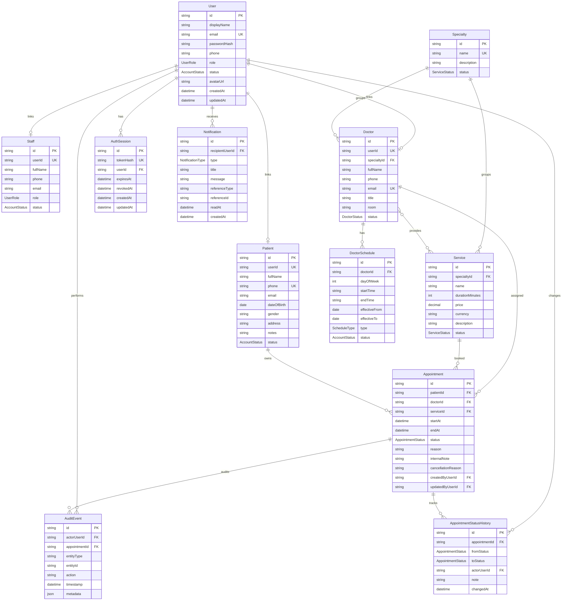

# Database ERD

## Document Control

| Trường | Giá trị |
| --- | --- |
| Trạng thái | `baseline` |
| Đối tượng đọc chính | Backend engineer, reviewer, AI agent |
| Cập nhật lần cuối | 2026-09-02 |
| Source of truth | `apps/api/prisma/schema.prisma`, `docs/03-architecture/database-schema.md` |

## Mục Đích

Tài liệu này bổ sung ERD dạng Mermaid để người đọc thấy quan hệ database nhanh hơn so với đọc Prisma schema đầy đủ. Đây là bản diagram hóa schema đã triển khai, không thay thế Prisma schema.

## ERD Tổng Quan

## Điểm Khác Giữa ERD Và Prisma Schema

- Mermaid không thể hiện đầy đủ Prisma implicit many-to-many join table giữa `Doctor` và `Service`; relation này tồn tại trong schema runtime.
- Diagram gom bớt `createdAt`/`updatedAt` ở một số entity để dễ đọc; schema thật vẫn có timestamp đầy đủ.
- Index chi tiết nằm trong `docs/03-architecture/database-schema.md` và `apps/api/prisma/schema.prisma`.
- Enum chi tiết nằm trong `docs/03-architecture/database-schema.md`.

## Business-Critical Relations

- `User -> Patient/Doctor/Staff` là linked profile dùng cho ownership và role-scoped access.
- `Appointment -> Patient/Doctor/Service` là lõi booking workflow.
- `DoctorSchedule -> Doctor` quyết định availability.
- `AppointmentStatusHistory` và `AuditEvent` giữ trace cho workflow và admin actions.
- `AuthSession` lưu token hash, không lưu plaintext bearer token.
