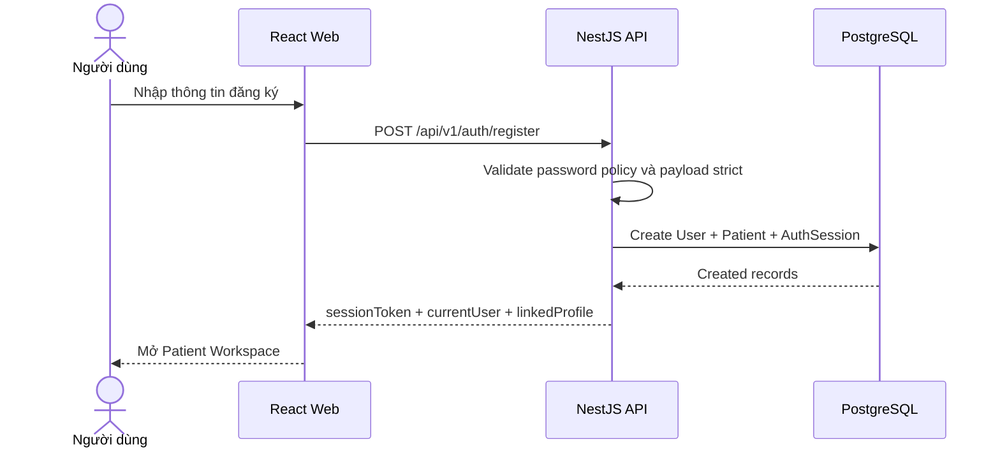
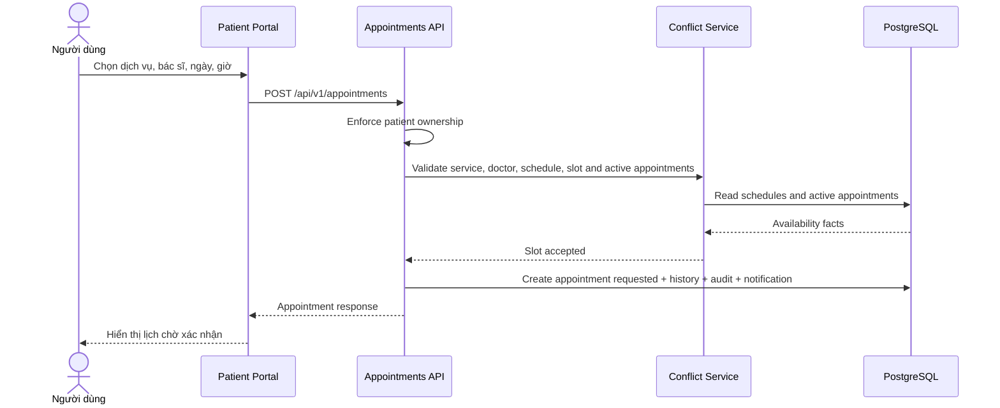
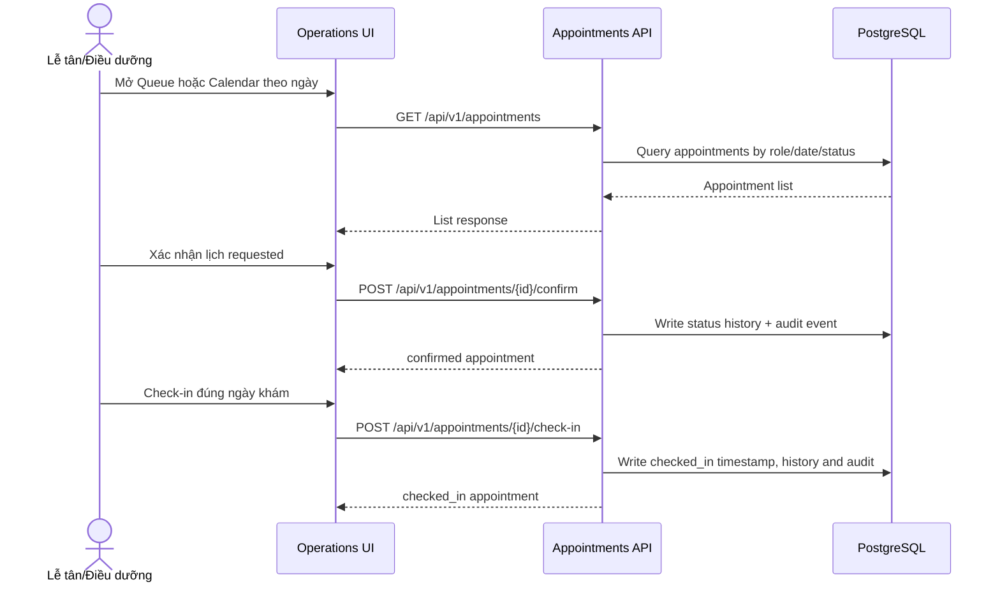
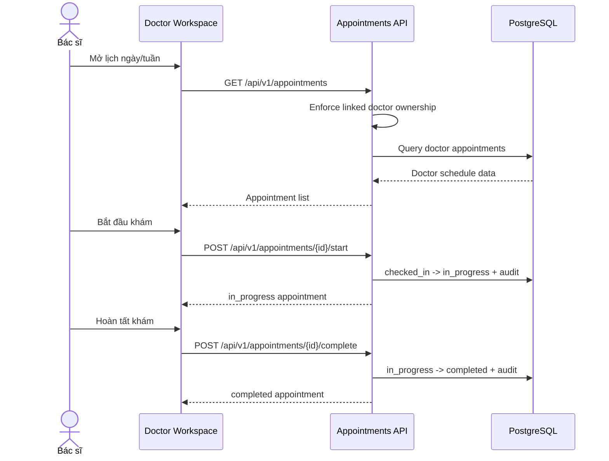
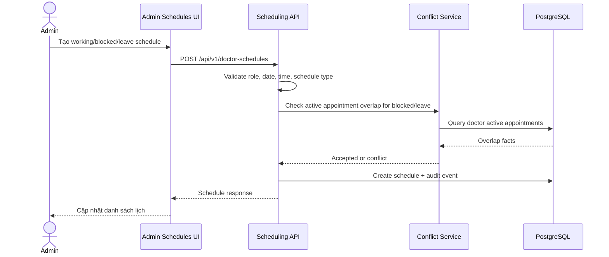
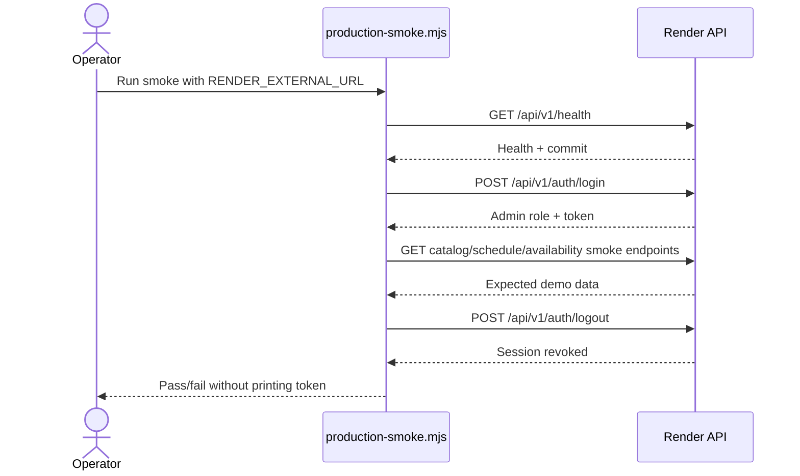

# Sequence Diagrams

## Document Control

| Trường | Giá trị |
| --- | --- |
| Trạng thái | `baseline` |
| Đối tượng đọc chính | Product owner, frontend/backend engineer, QA, AI agent |
| Cập nhật lần cuối | 2026-09-02 |
| Phạm vi | Sequence-level overview cho các flow chính của CareFlow v1 |

## Quy Ước

- `Web` là React frontend.
- `API` là NestJS API tại `/api/v1`.
- `DB` là PostgreSQL qua Prisma.
- Backend luôn là source of truth cho auth, authorization, conflict, transition và audit.

## SD-001: Register And Login

## SD-002: Patient Booking Request

## SD-003: Operations Confirm And Check-In

## SD-004: Doctor Visit Flow

## SD-005: Admin Schedule Management

## SD-006: Production Smoke

## Coverage Matrix

| Sequence | Requirement refs | Test evidence |
| --- | --- | --- |
| `SD-001` | `SRS-AUTH-*` | API auth unit/E2E, Web auth tests, API-mode Playwright |
| `SD-002` | `SRS-APT-*`, `SRS-SCHED-*` | API appointment/scheduling E2E, booking Playwright |
| `SD-003` | `SRS-APT-*` | Operations Playwright, API appointment E2E |
| `SD-004` | `SRS-AUTHZ-*`, `SRS-APT-*` | Doctor workflow Playwright, API authorization E2E |
| `SD-005` | `SRS-SCHED-*`, `SRS-AUDIT-*` | Scheduling E2E, admin schedule Playwright |
| `SD-006` | `SRS-DEPLOY-*` | `scripts/production-smoke.mjs`, acceptance checklist |
